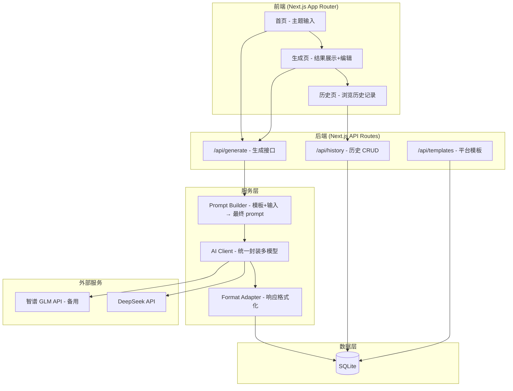

> **Model: deepseek-v4-pro (strong)**

> **Status: APPROVED** — 2026-07-28T07:19:56.794Z

# AI 自媒体内容生产工具 — 实现计划

> **Status: DRAFT**

---

## 需求提炼

**目标**：做一个面向中文自媒体创作者的 AI 内容生产 Web 工具——输入主题和平台，一键生成适配小红书、抖音、公众号等不同平台风格的图文文案和短视频脚本。创作者用这个工具把内容生产从"憋半天写一篇"变成"30 秒出一版"。

**非目标（不做）**：
- 不做多平台自动分发/发布（依赖平台开放 API，易被封，且技术债务重）
- 不做 AI 生成图片/视频文件（只生成提示词，实际图片让用户拿提示词去 Midjourney/SD 生成）
- 不做用户系统/付费墙（v1 单机可用，后续再加）
- 不做 SEO 优化/数据分析模块

**核心用户故事**：
1. 用户打开工具 → 输入主题（如"减脂期怎么吃食堂"）→ 选择平台（小红书）→ 点击生成 → 得到一篇小红书风格的图文文案 → 可编辑调整 → 复制使用
2. 用户选择抖音 → 同一主题生成短视频口播脚本 + 分镜建议
3. 用户不满意 → 点"换个风格"重新生成 → 保留历史版本可回溯

---

## 竞品与市场定位

| 竞品 | 优势 | 短板 |
|------|------|------|
| Jasper AI | 英文营销文案强 | 对中文自媒体场景水土不服，价格高($49/月起) |
| 秘塔写作猫 | 中文纠错/润色好 | 偏通用写作，缺少平台风格适配 |
| 豆包/文心一言 | 免费、中文好 | 通用聊天，无自媒体工作流封装 |
| 各平台内置 AI | 原生体验 | 锁平台，无法跨平台复用 |

**我们的切入点**：做"自媒体场景专用"这一层封装——不是又一个通用 AI 聊天，而是把 prompt 工程、平台风格模板、内容类型结构化，让创作者不用自己琢磨"怎么写 prompt 才能出小红书风格"。

---

## 技术选型

| 层 | 选择 | 理由 |
|----|------|------|
| 框架 | Next.js 14 (App Router) | 全栈一体，API Routes 直接做后端，零额外部署 |
| 语言 | TypeScript | 类型安全 |
| UI | Tailwind CSS + shadcn/ui | 快速出专业 UI，组件丰富 |
| 数据库 | SQLite + Prisma ORM | 零配置，轻量，单文件部署 |
| AI API | DeepSeek（主）+ 智谱 GLM（备） | DeepSeek 中文强、便宜(¥1/百万token)、国内直接调用 |
| 测试 | Vitest + Playwright | 单元 + E2E |
| 部署 | Vercel（免费层）或 Docker 自部署 | 灵活 |

---

## 架构设计



**数据流**：用户输入主题+平台 → Next.js API Route → Prompt Builder 根据平台模板拼装 prompt → AI Client 调 DeepSeek API → Format Adapter 解析返回内容为结构化数据 → 存 SQLite + 返回前端渲染。

---

## 数据模型

```
ContentTemplate (平台内容模板)
  - id, platform (xiaohongshu/douyin/gongzhonghao/weibo)
  - contentType (tuwen/short_video/long_article)
  - systemPrompt, userPromptTemplate, temperature

Generation (生成记录)
  - id, templateId, topic, platform, contentType
  - rawPrompt, rawResponse, formattedContent (JSON)
  - createdAt
```

---

## 反证 / 复现

### 关键假设与验证方式

1. **假设：DeepSeek API 对自媒体文案的中文质量足够好**
   - 验证：项目初始化后，第一个探针直接用 DeepSeek API 生成 5 篇不同平台风格的文案，人工评估
   - 若不通过 → 切换到智谱 GLM 或通义千问

2. **假设：shadcn/ui 能满足 UI 需求，无需自研组件**
   - 验证：先列出需要的 UI 组件清单（输入框、卡片、下拉选择、Markdown 渲染、历史列表），逐一确认 shadcn/ui 覆盖
   - 若不通过 → 缺口组件用 Radix UI 基元自建

3. **假设：SQLite 在单用户场景下性能足够**
   - 已有大量实践证明（SQLite 在 10 万行以内查询 <10ms），本工具 v1 不需要并发，直接采信

### 瑶光反证检查项

- [ ] DeepSeek API 可连通（用 curl 探针验证）
- [ ] Next.js 14 App Router 模板可启动（`npx create-next-app` 后 `npm run dev`）
- [ ] Prisma + SQLite 迁移可执行（`npx prisma migrate dev`）

---

## Wave 1: 项目骨架 + 核心生成链路

这是唯一需要先跑通的最小闭环——其他一切都在此基础上搭建。

**任务**：
1. [ ] 初始化 Next.js 14 项目 + TypeScript + Tailwind + shadcn/ui
2. [ ] 配置 Prisma + SQLite，定义 ContentTemplate 和 Generation 模型
3. [ ] 实现 Prompt Builder 模块（至少 3 个平台模板：小红书、抖音、公众号）
4. [ ] 实现 AI Client 封装（DeepSeek API，含错误处理和重试）
5. [ ] 实现 `/api/generate` 接口
6. [ ] 实现首页 UI（主题输入 + 平台选择 + 生成按钮 + 结果展示）
7. [ ] 写核心链路的集成测试
8. [ ] 端到端验证：输入主题 → 生成 → 看到结果

**验证命令**：`npm run dev` → 浏览器打开 → 输入"减脂期怎么吃食堂" → 选小红书 → 生成 → 确认返回合理文案

## Wave 2: 编辑 + 历史 + 模板扩展

1. [ ] 结果编辑功能（前端富文本编辑 + 保存修改）
2. [ ] 历史记录页面（列表 + 搜索 + 删除）
3. [ ] 模板扩展至 6+ 平台（B站、知乎、微博、头条）
4. [ ] 内容类型扩展（标题生成、评论区回复、直播话术）

## Wave 3: 体验打磨

1. [ ] 流式生成（stream response，逐字输出）
2. [ ] 深色模式
3. [ ] 响应式适配移动端
4. [ ] 一键复制、导出 Markdown
5. [ ] 多模型切换（用户可选 DeepSeek / 智谱 / 通义千问）
